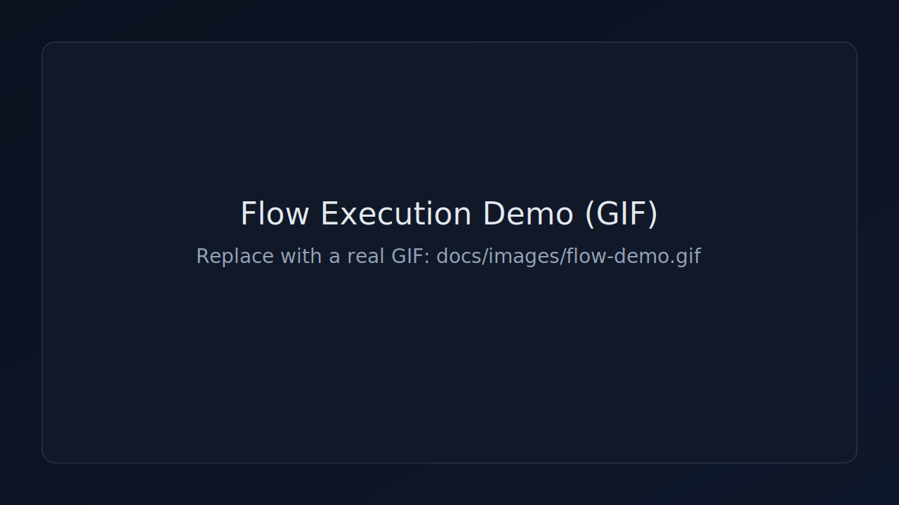
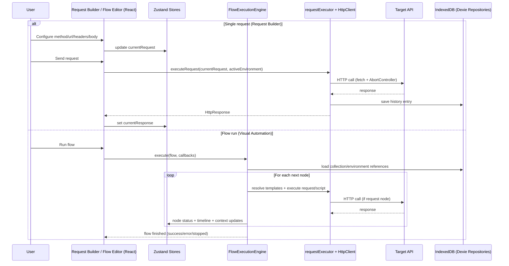

# ApoloQuest

**Postman + Visual Automation + Local-First**

Modern API client with visual workflow automation.

Build, test and automate complex API workflows with a node-based editor, fully local-first.

- Visual flow automation with an intuitive node editor
- Fast local-first architecture (IndexedDB + no backend required)
- Advanced scripting, loops, conditions and parallel execution



> Replace this placeholder with a real GIF at `docs/images/flow-demo.gif` and update this path.

## Quickstart

```bash
npm install
npm run dev
```

Open `http://localhost:5173`

## Why ApoloQuest?

ApoloQuest is built for developers that need to automate API workflows, not only send isolated requests.

- **Why not only Postman?** ApoloQuest adds visual automation for multi-step workflows.
- **Why visual flows?** It reduces cognitive load for branching, retries, extraction and orchestration.
- **Why local-first?** Your data and collections stay on your machine by default.
- **What problem does it solve?** Repetitive API sequences, integration testing flows and data pipelines.

## Execution Sequence



## Features

### Core
- Request Builder (methods, headers, auth, body, query params, scripts)
- Collections (organize, reorder, duplicate and move requests)
- Environments (variable sets with `{{variable}}` syntax)

### Automation
- Visual Flows (request/extract/condition/setVar/delay/log/loop/parallel/map/script/errorHandler)
- Collection Runner (batch execution with progress and summary)
- Parallel and scripted transformations for complex pipelines

### Developer Experience
- History with search/filter/sort
- Import/Export (native + Postman Collection)
- cURL generation
- Pre-request and post-request scripting

## Architecture Snapshot

```text
UI (React + ReactFlow)
   ->
State (Zustand)
   ->
Storage (IndexedDB via Dexie)
   ->
HTTP Client (fetch + AbortController)
```

## Technical Details

- **Runtime:** flow engine with node-level execution control and abort support.
- **Validation:** Zod schemas for runtime and import boundaries.
- **Storage:** Dexie repositories over IndexedDB (local-first persistence).
- **HTTP:** custom fetch-based client with request cancellation and timing metrics.
- **Type safety:** strict TypeScript with typed domain models.

## Stack

- React 18
- TypeScript
- Vite
- Zustand
- Dexie
- Zod
- ReactFlow
- Tailwind CSS
- Lucide React

## Project Structure

```text
src/
  features/
    collections/
    curl-generator/
    environments/
    flows/
      models/
      repo/
      runtime/
      store/
      ui/
    history/
    import-export/
    request-builder/
    runner/
    settings/
  shared/
    design-system/
    http/
    models/
    storage/
    ui/
    utils/
    validation/
```

## Scripts

```bash
npm run dev        # local development
npm run build      # production build
npm run preview    # preview build
npm run lint       # eslint
npm run typecheck  # typescript checks
```

## Quality Gate

```bash
npm run lint && npm run typecheck && npm run build
```

## Changelog

- **v2.3.0**: advanced flow nodes (loop, parallel, map, script, error handler)
- **v2.2.0**: initial flows system and visual editor
- **v2.1.0**: UI polish and UX improvements
- **v2.0.0**: design system overhaul

## License

MIT
